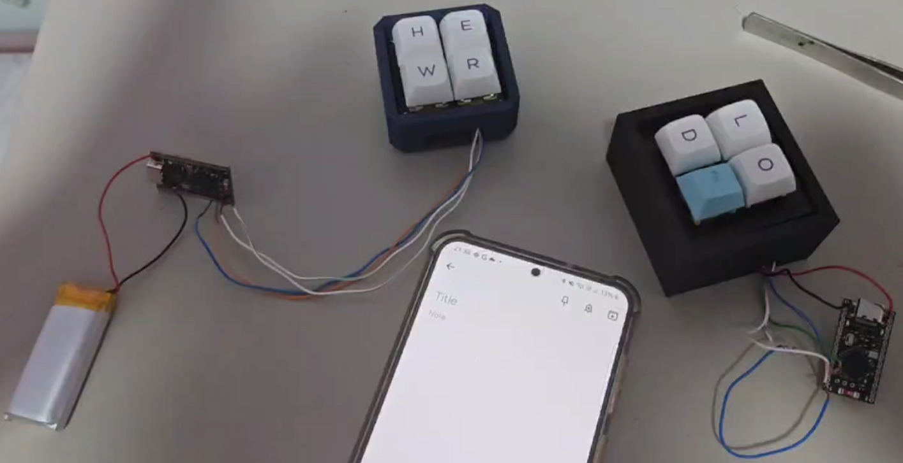
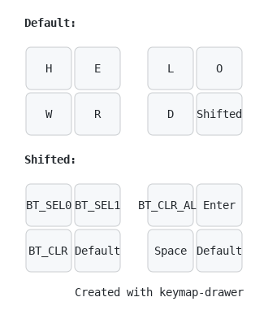
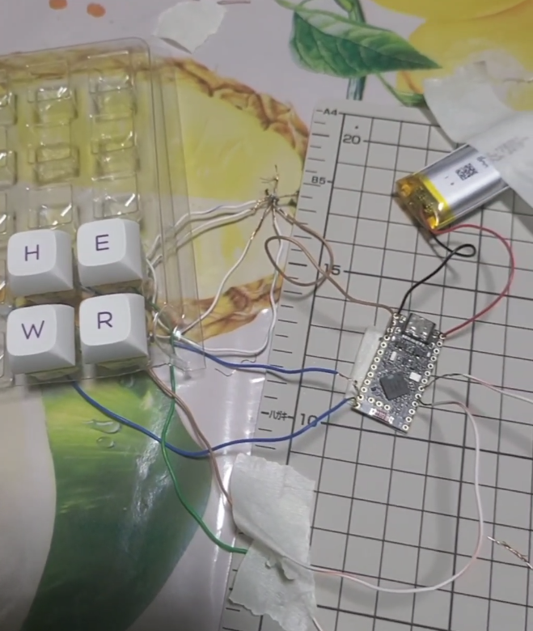
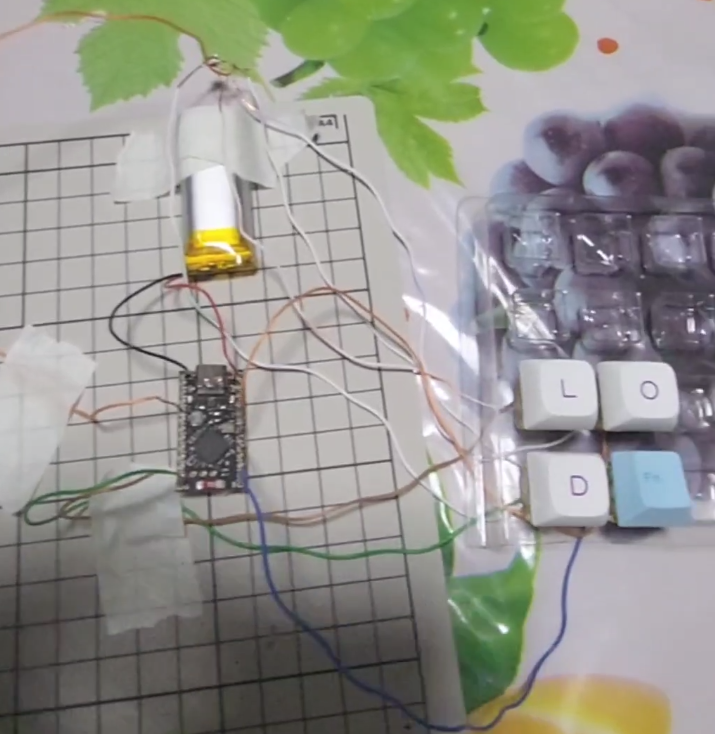
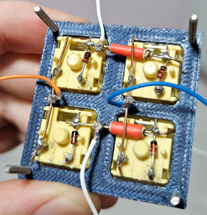
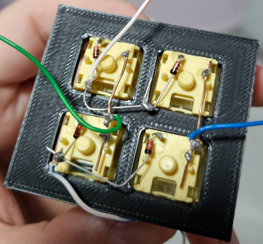
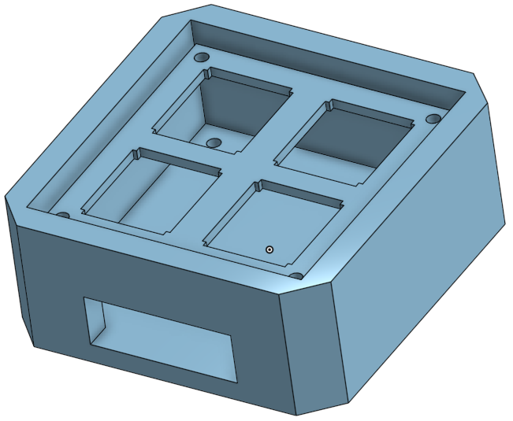
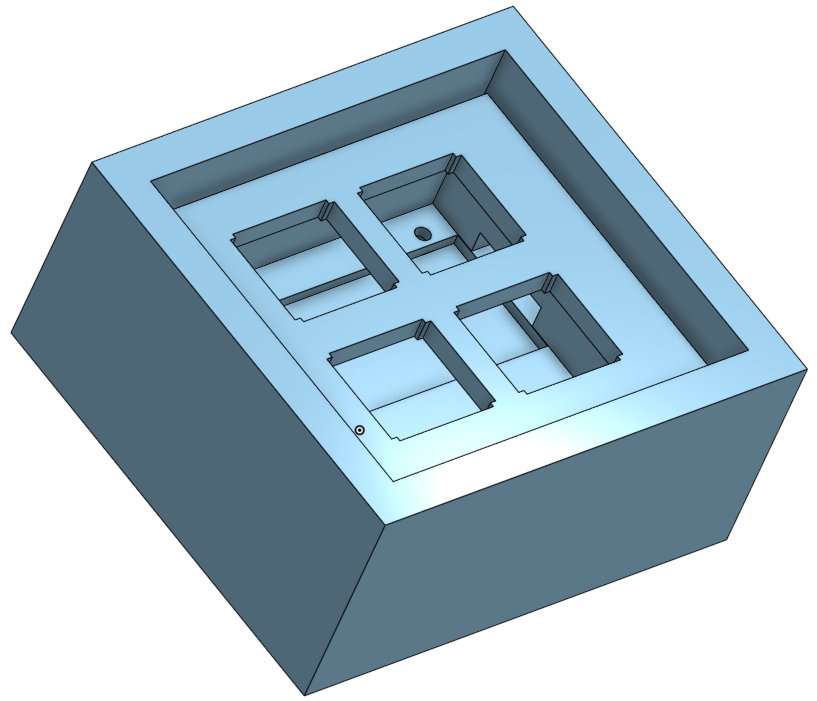

# Helloworld8

The Helloworld8 is an extremely simple proof of concept handwired split
keyboard powered by [ZMK firmware](https://github.com/zmkfirmware/zmk).

The keyboard contains 8 keys to type the phase `"hello world"`, allows switching
between 2 Bluetooth profiles, and is meant for the user (me) to get acquainted with the basic concepts of building a keyboard.

The repo contains the keymap for direct wiring and matrix wiring.



## Keymap



## Direct wiring - Build log

Super experimental attempt at wiring everything up. First time soldering, so I decided to only solder the key switches, and tape everything else since I want to reuse the components for matrix wiring and my next proper keyboard.

| Left    | Right |
| -------- | ------- |
|   |     |

### Bill of materials


| Material | Cost (SGD) | Notes |
| -------- | ------- | ------- |
| NRF52840 Dev Board | 2x $8.18 from Shopee | [joric](https://github.com/joric/nrfmicro/wiki/Alternatives#supermini-nrf52840): `"LED colors are swapped, RED is Bluetooth (user LED), BLUE is charger, should be vice-versa"`. Caused confusion when trying to wire the batteries |
| 3.7V 1000mAH 102050 Lithium Polymer | Pack of 2, $16.30, Shopee | Decided 1000mAh based on [ZMK Power Profiler](https://zmk.dev/power-profiler), but it's definitely too large as compared to the Microcontroller. The connecting cables are very annoying to rest on the microcontroller, but that's on me for not wanting to solder the battery to the MC |
| Cherry yellow switches | Pack of 10, $4, random shop | |
| Soldering tools (Soldering iron, Stand, Solder, Flux, Desoldering Pump)| Free | Borrowed from a friend |
| Soldering Mat | $9, Artfriend | |
| Safety Googles | $7 | |
| Wires | Free | Extracted copper wires from a spare Ethernet cable|
| Keycaps | Free-ish | Reused from another unused set of key caps. Not strictly needed for this POC |

## Matrix wiring - Build log

- Wrongly configured the initial firmware, due to bad / lazy copy pasting resulting in
```
    // wrong
    <&gpiogpio1 8 (GPIO_ACTIVE_HIGH | GPIO_PULL_DOWN)>
```
instead of
```
    // correct
    <&pro_micro 8 (GPIO_ACTIVE_HIGH | GPIO_PULL_DOWN)>
```


| Left    | Right |
| -------- | ------- |
|   |     |

- Started using [OnShape](https://www.onshape.com/en/) to 3D print the keyboard cases and boards, first time using CAD and 3D printing as well
    - The large batteries sizes came back to haunt me, I designed 2 different cases:
        - 1 for housing only the switches, while the microcontroller and battery are outside, because I'm noob:
        
            - The plate is meant to be screwed into the case.
        - 1 for housing the switches, microcontroller, and battery, with an opening for type C cable, now that I'm more confident:
        

            - https://github.com/user-attachments/assets/bcf295e2-c2a0-40e9-bb1a-28639a99ccf7

            - The type C opening failed miserably, the opening was wide enough for the header, but too deep for the cable to enter
            - The microcontroller slot worked __too well__, the microcontroller snap fitted into the -slot, and I had to spent a long time prying it out
            - The case was __still too small__, the battery barely fit in with the microcontroller, and I ended up having to take the microcontroller outside
    - Files are publicly viewable [here](https://cad.onshape.com/documents/911fa885ab43e3a60bd96693/w/6dba302a51f25b7591cbfc66/e/7a5c2ee8be49943fcd48c01e)

- Had lots of trouble getting the batteries wires to stick into the microcontrollers, due to not wanting to solder the wires for this POC.

### Bill of materials

On top of the materials above,

| Material | Cost (SGD) | Notes |
| -------- | ------- | ------- |
| Copper wires, 1m, coiled | $6 x2, electronic shop | Used less than 50cm of the wires |
| Heat shrink tube | $6, electronic shop | Bad purchase, the smallest tube wasn't able to wrap the copper wires and had lots of space to spare. Had to use additional tape (see Left Keyboard above photo) |
| Diodes, pack of 100 | $2 x2, Shoppee | |

## Vid Example

https://github.com/user-attachments/assets/a2e4e436-d98b-4557-b4f3-c82a395ebc5b

## Thoughts and Future work

With this experience, I'm more ready now to tackle building my own `3x6+5` split keyboard tailored to my hand size. The bluetooth connection is stable, so my concerns work usage wise are satisfied.

The goal is to have a cheap low profile wireless keyboard with easy transportation, so in order to keep costs low, I'll be trying to 3d print the kepcaps as well for low profile switches. I have already brought the switches, which costs the largest chunk of the whole project so far. Maybe I'll look into membrane keyboards / scissors switches for the following (next-next) keyboard.

I'm planning to experiment using snap fits creating a proper keyboard case this time to avoid screwing, to make it easy to join / unjoin the keyboards when I leave / arrive for work.

Maybe after my 2nd keyboard, I'll look into creating custom PCB design and boards as well; Soldering for just 8 switches for `Helloworld8` already feels tedious, I can't imagine how I'll feel after working on the `3x6+5` split keyboard.

Thanks for reading through this retrospection!
