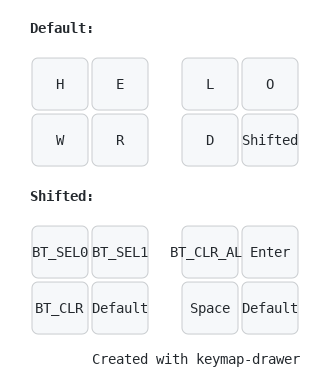
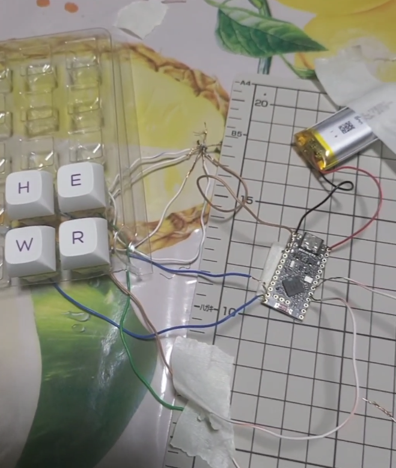
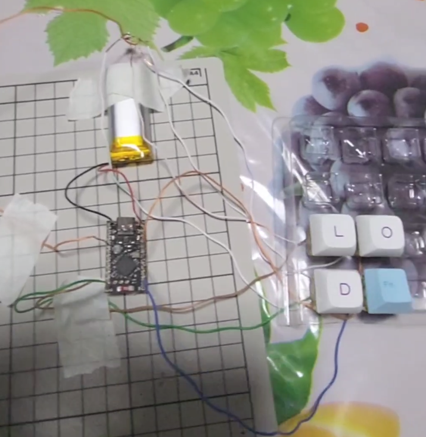

# Helloworld8

The Helloworld8 is an extremely simple proof of concept split
keyboard powered by [ZMK firmware](https://github.com/zmkfirmware/zmk)

The keyboard contains 8 keys to type the phase `"helloworld"`, allows switching
between 2 Bluetooth profiles, and is meant for the user (me) to get acquainted with the basic concepts of building a keyboard.

The repo (currently) contains the keymap for direct wiring; Matrix wiring is still a work-in-progress.

## Keymap

## Direct wiring - Build log

Super experimental attempt at wiring everything up. First time soldering, so I decided to only solder the key switches, and tape everything else since I want to reuse the components for matrix wiring and my next proper keyboard.

| Left    | Right |
| -------- | ------- |
|   |     |

### Bill of materials

| Material | Cost (SGD) | Notes |
| -------- | ------- | ------- |
| NRF52840 Dev Board | 2x $8.18 from Shopee | [joric](https://github.com/joric/nrfmicro/wiki/Alternatives#supermini-nrf52840): `"LED colors are swapped, RED is Bluetooth (user LED), BLUE is charger, should be vice-versa"`. Caused confusion when trying to wire the batteries |
| 3.7V 1000mAH 102050 Lithium Polymer | Pack of 2, $16.30, Shopee | Decided 1000mAh based on [ZMK Power Profiler](https://zmk.dev/power-profiler), but it's definitely too large as compared to the Microcontroller. The connecting cables are very annoying to rest on the microcontroller, but that's on me for not wanting to solder the battery to the MC |
| Cherry yellow switches | Pack of 10, $4, random shop | |
| Soldering tools (Soldering iron, Stand, Solder, Flux, Desoldering Pump)| Free | Borrowed from a friend |
| Soldering Mat | $9, Artfriend | |
| Wires | Free | Extracted copper wires from a spare Ethernet cable|
| Keycaps | Free-ish | Reused from another unused set of key caps. Not strictly needed for this POC |